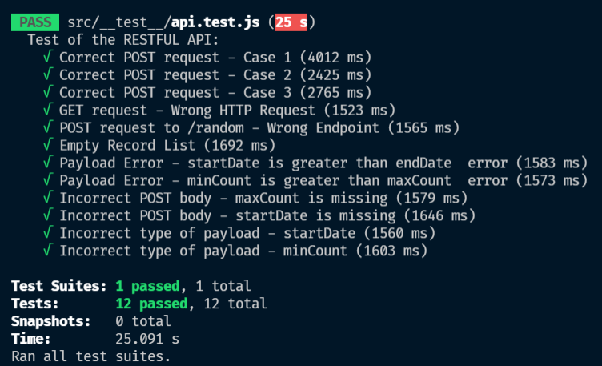

# Getir Case Study Challenge Documentation

This is a bare-bones of a application providing a REST API with a single endpoint that fetches the data in the provided MongoDB collection and return the results in the requested format.

In this project an application is created using Express framework. Application is only handle POST requests. After the POST request with appropriate request payload it fetches the data in the provided MongoDB collection and return the results in the requested format. Also Mongoose is used as ODM library. Unit tests are made by Jest and Supertest. Besides these, Joi is used for validation, dotenv is used as environment variable module and http-status is used for http status code. Moreover, nodemon is used during development phase.

VS Code is used as IDE, Postman is used for API testing and MongoDB Compass is used for MongoDB GUI.

Base URL :https://getir-challenge-aselcuktuncer.herokuapp.com/records

Swagger Documentation: https://app.swaggerhub.com/apis-docs/aselcuktuncer/getir-case-study/1.0.0

The entire application is contained within the `src` folder.

`__test__` runs tests.

`config` enables us to utilize enviroment variables

`controllers` serves as middlewares for API requests

`loaders` is related to database connection

`middlewares` is used as helper documents such as error handler or validation function

`models` contains model - record -

`routes` contains routes which is only a POST method to /records

`services` carry out database operations

`validations` ensure us to send appropriate request payload

`app.js` contains express app

`server.js` runs the app.listen() method.

## Request Using Endpoint URL

    https://getir-challenge-aselcuktuncer.herokuapp.com/records

## Git Clone Repository

    $ git clone https://github.com/getir-nodejs-bootcamp/getir-nodejs-bootcamp-graduation-project-aselcuktuncer

## Install NPM Packages

    npm i

## Start App

    npm start

## Run Tests

    npm test

# REST API

The REST API to the example app is described below.

## Get records based on count and dates

### Request Payload

`POST /records`

    {
        "startDate": "2017-01-12",
        "endDate": "2018-02-15",
        "minCount": 100,
        "maxCount": 300
    }

### Response

    Status: 200 OK
    {
        "code": 0,
        "msg": "Success",
        "records": [
            {
                "key": "TAKwGc6Jr4i8Z487",
                "createdAt": "2017-01-28T01:22:14.398Z",
                "totalCount": 170
            },
            {
                "key": "TAKwGc6Jr4i8Z487",
                "createdAt": "2017-01-28T01:22:14.398Z",
                "totalCount": 120
            }
        ]
    }

## Paramaters

| Parameter | Type     | Description                |
| :-------- | :------- | :------------------------- |
| `startDate` | `Date` | `YYYY-MM-DD format` |
  `endDate` | `Date`|`YYYY-MM-DD format`
  `minCount`|`Number`| `For filtering the counts array`
  `maxCount`|`Number`| `For filtering the counts array`

## Error Types

| Code | Description |
| --- | --- |
| `0` | Success operation |
| `1` | Request sent to the wrong endpoint or incorrect HTTP method |
| `2` | Request payload is incorrect - such as minCount is missing |
| `3` | Empty record list - might be the database connection error |

## Tests

12 different unit test is made by Jest and Supertest. As can be seen in the photo, 4 different tests type are implemented: success, wrong endpoint or incorrect HTTP method, empty record list or incorrect request payload

## Demo

    https://getir-challenge-aselcuktuncer.herokuapp.com/records
